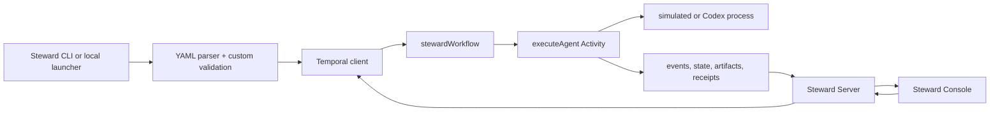
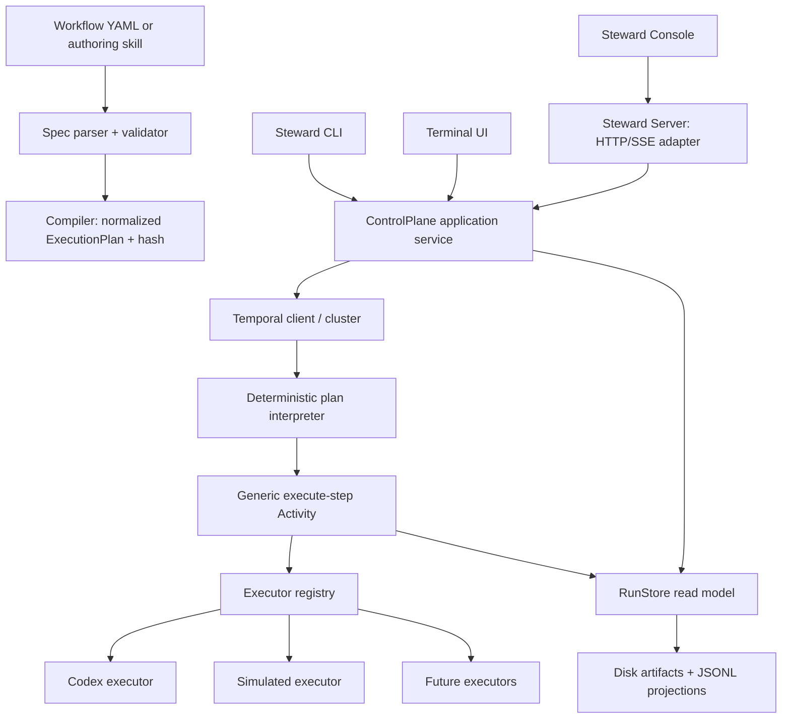

# Steward CLI architecture and product specification

Status: target reference, staged by the [production roadmap](production-roadmap.md). Last aligned: 2026-09-05.

This document describes the installable CLI, presentation, and future YAML language. The [vision](vision.md) sets scope; the [decision register](decisions.md) records adopted choices; the [technical design](technical-design.md) governs execution, identity, storage, and migration contracts. Those documents take precedence over older details here. Features below are targets, not shipped capabilities. The current `version: 1` format and human-input gates remain the implemented language. Under ADR-016, pre-adoption Workflow types are not compatibility targets.

The approved product components are **Steward CLI**, **Steward Server**, and **Steward Console** (the browser UI). This older command proposal retains lowercase `yamlflow` executable, configuration, and schema examples as historical target identifiers; approving the display name has not implemented or renamed those proposed contracts. Current `YAMLFLOW_*` settings and Temporal execution identities remain compatible.

## Product definition

Steward is a durable workflow runner whose source of intent is YAML.

An operator should be able to:

1. describe a workflow in YAML or ask an agent to author it from natural language;
2. validate and compile it without starting anything;
3. run it from one CLI command;
4. observe and control it in a terminal UI;
5. detach and reattach without changing execution;
6. recover an interrupted agent session through an explicit command; and
7. optionally open a web dashboard backed by the same state and control contracts.

The main orchestrator coordinates only. Agent prompts execute only through bounded executor Activities.

## Current architecture

The current demo has a good durable kernel:

- `src/definition.ts` parses YAML, normalizes defaults, creates node output schemas, rejects unknown dependencies and DAG cycles, validates demo output, and hashes the definition.
- `src/workflows.ts` contains the single `stewardWorkflow` Temporal interpreter. It finds dependency-ready nodes, drains a rolling queue under global/group/node limits, performs bounded node loops, and waits for recovery Updates.
- `src/activities.ts` owns filesystem and provider side effects. It resolves prompts, runs simulated or Codex work, heartbeats provider-session identity, validates output, persists human-readable agent messages, and commits completion receipts.
- `src/completion-receipt.ts` binds successful output to workflow/node/session/prompt/schema identity with two immutable receipt copies.
- `src/store.ts` appends readable events and rebuilds `state.json` from `events.jsonl`. Temporal history remains the scheduling authority.
- `src/client.ts` starts `stewardWorkflow` executions and submits recovery Updates.
- Steward Server in `src/server/index.ts` scans run projections, exposes snapshot/input/recovery HTTP endpoints, streams snapshots over SSE, and serves Steward Console from `ui/` through `src/server/templates.ts`. Root `src/server.ts` is a compatibility entrypoint.
- Steward CLI in `src/cli/start.ts` and `src/cli/answer.ts` exposes callable command functions. `src/cli/launcher.ts` is the local process supervisor that starts Temporal, the worker, Steward Server, and optionally an example run. Root `src/start.ts`, `src/answer.ts`, and `src/launcher.ts` retain the existing command entry paths.

### Current request path



### Gaps between the demo and a CLI product

1. There is no installable `yamlflow` binary or stable command/output contract.
2. `start.ts` hand-parses four flags and only prints the newly created IDs.
3. `launcher.ts`, `server.ts`, the example workflow, and the example input are coupled through defaults and environment variables.
4. YAML validation is one custom parser pass. There is no published meta-schema, source-positioned diagnostics, declared workflow input schema, compiled-plan artifact, or standalone validation command.
5. `groups` currently combine visual grouping and concurrency limits; they are not executable nested blocks. A loop belongs to one node rather than a real multi-step block.
6. Provider dispatch is an `if` branch inside one Activity module rather than an executor registry.
7. The scheduler is wave-oriented. A dependent step waits for the whole ready wave, even when only its own dependencies have committed.
8. Event/message projection writes use process-local Promise serialization. It is sufficient for the current single worker process but not a multi-process event sequencer.
9. The web server is both presentation server and control endpoint. The CLI has no reusable application/control service beneath it.
10. There is no TUI, non-interactive JSON contract, configuration profile, runtime doctor, packaged authoring skill, or clean detach/attach lifecycle.

## Target architecture

The target has six layers. Dependencies point inward; presentation code never owns workflow decisions.



### Architectural decisions

#### 1. YAML is source; a compiled plan is execution input

Temporal must not interpret raw YAML or read files. `yamlflow validate` parses author YAML and `yamlflow plan` compiles it into canonical `ExecutionPlan` JSON. `run` sends the immutable compiled plan, its SHA-256 hash, and validated initial input to Temporal.

Every run persists:

- `workflow.yaml` — exact submitted source;
- `plan.json` — normalized execution plan;
- `plan.sha256` — canonical plan identity;
- `input.json` — validated initial input;
- `run-manifest.json` — environment, workspace, policy, and executor bindings; and
- validator/compiler versions.

The first release caps compiled plan size and embeds it in Workflow input. Large-plan claim checking is a later storage feature.

#### 2. One generic, versioned Temporal interpreter

Workflow YAML does not generate TypeScript Workflow code. A stable workflow type, initially `yamlflowInterpreterV3`, interprets `ExecutionPlan.v1` using deterministic state only. Filesystem, provider, network, clocks outside Temporal APIs, secrets, and subprocess work stay in Activities.

After adoption, behavioral changes use replay tests and Temporal patching or a new Workflow type. Before adoption, ADR-016 keeps only the current Workflow registered and preserves older artifacts without promising replay.

#### 3. Structural blocks, executable steps, and pools are different concepts

- A **step** performs work: agent, human approval, or child workflow.
- A **block** owns control structure: group, parallel, or bounded loop. Blocks contain steps or other blocks and are visible in the TUI.
- A **pool** limits resources across unrelated scopes within one run. Operator policy separately limits work across runs; a per-worker limit is not a cluster-wide quota.

This makes “a loop inside a group” real runtime structure instead of a visual inference.

#### 4. CLI and web use the same control service

`ControlPlane` is a TypeScript application service, not an HTTP dependency. Local CLI/TUI calls it in process. The optional web server is a thin HTTP/SSE adapter over the same methods. Neither UI edits state files or decides that a node is complete.

#### 5. Temporal history is authoritative; RunStore is a rebuildable read model

Temporal determines scheduling and completion. `RunStore` gives the CLI and dashboard fast, human-readable state. Every command and transition has a stable idempotency key.

The local backend uses a separate transactional application database for evidence, unique event IDs, and monotonic per-run sequence numbers. `EvidenceStore` retains commands, dispatches, and accepted commits; `ArtifactStore` retains immutable content; `RunStore` presents rebuildable snapshots. It materializes `events.jsonl`, `state.json`, and per-step artifacts for inspection. Projections can be rebuilt without rerunning accepted work; the evidence database itself is not disposable. See ADR-004 for the separate production shared backend.

#### 6. Executor capabilities are policy-bound plugins

A workflow requests an executor and capabilities; it cannot grant itself authority. The effective permission set is the intersection of workflow request, installed executor capability, and operator policy.

Secrets are referenced by name and resolved inside Activities. Secret values must not be stored in Workflow input, events, prompts, or readable artifacts.

## CLI contract

Package an executable named `yamlflow`. Use Commander for command parsing and Ink for the full-screen terminal UI. Keep command handlers thin; all behavior belongs to `ControlPlane`, compiler, runtime, or store services.

```text
yamlflow validate <workflow.yaml> [--input <input.json>] [--json]
yamlflow plan <workflow.yaml> [--input <input.json>] [--json] [--write <plan.json>]
yamlflow run <workflow.yaml> --input <input.json> [--profile <name>]
             [--detach] [--tui auto|always|never] [--output human|json]
             [--dashboard]
yamlflow attach <run-id|latest> [--tui auto|always|never]
yamlflow resume <run-id|latest>
yamlflow status <run-id|latest> [--watch] [--json]
yamlflow list [--status running|waiting|completed|failed] [--json]
yamlflow inspect <run-id> [--step <qualified-id>] [--messages|--input|--output]
yamlflow export <run-id> --output <directory>
yamlflow events <run-id> [--follow] [--format human|jsonl]
yamlflow recover <run-id> --request <id> --same-session|--fresh-session|--abort
yamlflow answer <run-id> --request <id> --file <answer.json>
yamlflow cancel <run-id>
yamlflow dashboard [<run-id>] [--port <port>] [--allow-control]
yamlflow runtime up [--detach]
yamlflow runtime down
yamlflow doctor [--json]
yamlflow skill path
yamlflow skill install --target codex|agents --scope user|project
yamlflow migrate <v1-workflow.yaml> --write <v2-workflow.yaml>
```

### Command semantics

- `validate` performs syntax, structural, semantic, executor-capability, policy, and optional input validation. It has no runtime side effects.
- `plan` includes validation, prints a topology summary, and may write canonical compiled JSON. It does not contact Temporal.
- `run` validates, compiles, persists source/plan/input, starts exactly one Workflow ID, then attaches. In an interactive terminal the default presentation is the TUI.
- `--detach` exits after durable start acceptance and prints the run/workflow IDs.
- A non-TTY `run` prints stable human event lines and waits. `--output json` prints one versioned result envelope, never a mixture of prose and JSON.
- `attach` is presentation-only. It never starts or retries work.
- `resume` ensures the configured runtime/worker is available and then attaches to the same Workflow ID. It never creates a replacement run.
- `recover` submits a validated Temporal Update. It never edits projections directly.
- `answer` submits a schema-validated human answer through the same control service. Preserve the current V1 `{answer: string}` contract and `npm run answer` compatibility.
- `cancel` requests durable cancellation and reports cleanup status. It is separate from detach and reattach.
- `export` writes a versioned manifest and permitted artifacts to a new directory, verifies included hashes, and explicitly labels incomplete evidence or redacted omissions. Its contract is defined in the technical design.
- `run`, `answer`, `recover`, and `cancel` accept `--command-id`. The CLI persists a generated ID before submission when it is omitted; retrying an uncertain command reuses that ID. Identical duplicates return the original receipt, while conflicting reuse rejects.
- `dashboard` is optional. It binds loopback by default and is read-only unless `--allow-control` is explicit.
- `runtime up` may start the local Temporal development server and worker. Remote profiles connect to an existing Temporal deployment instead.

### Profiles and runtime binding

Portable plans must not contain machine-specific absolute paths or secret values. At start time, the CLI creates a `RunManifest` that binds the portable plan to one environment:

```ts
interface RunManifestV1 {
  schema: "yamlflow.run-manifest.v1";
  runId: string;
  workflowId: string;
  planSha256: string;
  inputSha256: string;
  profile: string;
  temporal: { namespace: string; taskQueue: string };
  workspace: { logicalName: "project"; absolutePath: string };
  effectivePolicySha256: string;
  executorBuilds: Record<string, string>;
}
```

Configuration precedence is command flags, `YAMLFLOW_*` environment variables, project `.yamlflow/config.yaml`, user configuration, then safe defaults. Secret material is supplied only through an executor-specific secret resolver.

```yaml
defaultProfile: local
profiles:
  local:
    temporal:
      address: 127.0.0.1:7233
      namespace: default
      taskQueue: yamlflow-agent-nodes
    runtime:
      kind: local-dev
      autoStart: true
    store:
      kind: local
      path: .yamlflow/runtime
    policy: .yamlflow/policy.yaml
```

`local-dev` may auto-start a detached, health-checked Temporal development server and worker. The TUI is never their parent-lifetime boundary. `runtime down` refuses while open workflows exist unless the operator explicitly supplies a destructive override. Remote profiles never attempt to start or stop Temporal infrastructure.

### Output and exit codes

stdout is the requested result format. Diagnostics and operational warnings go to stderr.

| Exit | Meaning |
|---:|---|
| 0 | Command succeeded; detached run was durably accepted or attached run completed |
| 1 | Unexpected internal error |
| 2 | CLI usage, YAML, semantic, policy, or input validation error |
| 3 | Runtime, Temporal, executor, or configuration unavailable |
| 4 | Attached Workflow reached terminal failure |
| 5 | Non-interactive command stopped because operator recovery is required |
| 130 | Local UI interrupted; the durable run was not cancelled |

Machine envelopes carry a schema such as `yamlflow.command-result.v1`. Streaming machine output is available only from `events --format jsonl`, whose records use `yamlflow.event.v1`.

## Terminal UI specification

The TUI is the default interactive surface for `run`, `attach`, and `resume`.

```text
┌ Steward  product-launch  RUNNING  wave 3  4/8 ─────────────────────────────┐
│ Runs          │ Workflow                                       │ Inspector  │
│ > current     │ Foundation                                     │ synthesis  │
│   previous    │   ✓ Brief analyst                              │ RUNNING    │
│               │ Discovery [parallel 3]                          │            │
│               │   ✓ Audience   ✓ Feasibility   ✓ Narrative     │ readable   │
│               │ Strategy [loop 2/3, score >= .85]               │ agent      │
│               │   ↳ ● Strategy synthesizer ───────────────┐     │ messages   │
│               │     └─────────────────────────────────────┘     │            │
├───────────────┴────────────────────────────────────────────────┴────────────┤
│ 31  synthesis  Drafting structured output                                  │
│ 32  synthesis  Output committed                                             │
└ ↑↓ select  Enter inspect  r recover  o output  w web  d detach  q quit ─────┘
```

Requirements:

- Show executable agents inside their blocks, not just block boxes.
- Render nested group/parallel/loop boundaries and loop return paths.
- Show iteration, maximum, condition, and passed/exhausted state on every loop.
- Fan-in is visibly blocked until all required branches commit.
- Selected-step stream shows only human-readable agent messages by default. Operational provider protocol is available only in an explicit audit view.
- Resize without losing selected step or scroll position. Provide a linear compact mode below 80 columns.
- On connection loss, keep the last snapshot, show `RECONNECTING`, reconnect with the last event sequence, then reconcile a fresh snapshot without clearing the screen.
- `q` detaches; it does not cancel. Cancellation is a separately confirmed command.
- Recovery choices state exactly whether the same provider session exists and why it may be unsafe.
- Respect `NO_COLOR`, reduced motion, non-interactive terminals, and accessible contrast.

Ink supplies the React component model and terminal flex layout. TUI components consume presentation view models and do not import Temporal SDK or filesystem modules directly.

## YAML authoring specification V2

Use a versioned Kubernetes-style envelope and JSON Schema Draft 2020-12 for workflow input and step output contracts.

```yaml
apiVersion: yamlflow.dev/v1alpha1
kind: Workflow
metadata:
  name: product-launch
  title: Product launch brief

spec:
  input:
    schema:
      $schema: https://json-schema.org/draft/2020-12/schema
      type: object
      additionalProperties: false
      required: [product, brief, launch_window]
      properties:
        product: { type: string }
        brief: { type: string, minLength: 1 }
        launch_window: { type: string }

  defaults:
    executor: agent.codex
    retry:
      maximumAttempts: 2
    timeout: 30m

  pools:
    codex:
      maxConcurrency: 4

  steps:
    intake:
      kind: agent
      title: Brief analyst
      executor: agent.codex
      pool: codex
      requests:
        workspace: project
        filesystem: read
        network: deny
      prompt: Normalize the product brief.
      with:
        product: $input.product
        brief: $input.brief
      output:
        schema:
          type: object
          additionalProperties: false
          required: [problem, audience]
          properties:
            problem: { type: string }
            audience: { type: string }

    discovery:
      kind: parallel
      title: Discovery
      needs: [intake]
      maxConcurrency: 3
      steps:
        audience:
          kind: agent
          executor: agent.codex
          pool: codex
          prompt: Research audience jobs and objections.
          with:
            brief: $steps.intake.output
          output:
            schema:
              type: object
              required: [jobs]
              properties:
                jobs: { type: array, items: { type: string } }
        feasibility:
          kind: agent
          executor: agent.codex
          pool: codex
          prompt: Review feasibility and risks.
          with:
            brief: $steps.intake.output
          output:
            schema:
              type: object
              required: [risks]
              properties:
                risks: { type: array, items: { type: string } }
      expose:
        audience: $steps.discovery.audience.output
        feasibility: $steps.discovery.feasibility.output

    strategy:
      kind: loop
      title: Strategy refinement
      needs: [discovery]
      maxIterations: 3
      onExhaustion: fail
      until:
        ref: $steps.strategy.synthesis.output.quality_score
        op: gte
        value: 0.85
      carry:
        previous_strategy: $steps.strategy.synthesis.output
      steps:
        synthesis:
          kind: agent
          executor: agent.codex
          pool: codex
          prompt: Reconcile discovery into a launch strategy.
          with:
            discovery: $steps.discovery.output
            previous_strategy: $loop.previous.previous_strategy
          output:
            schema:
              type: object
              additionalProperties: false
              required: [recommendation, quality_score]
              properties:
                recommendation: { type: string }
                quality_score: { type: number, minimum: 0, maximum: 1 }
      expose:
        strategy: $steps.strategy.synthesis.output

    final:
      kind: agent
      needs: [strategy]
      executor: agent.codex
      pool: codex
      prompt: Produce the final decision brief.
      with:
        strategy: $steps.strategy.output.strategy
      output:
        schema:
          type: object
          additionalProperties: false
          required: [recommendation]
          properties:
            recommendation: { type: string }

  output:
    recommendation: $steps.final.output.recommendation
```

### Step kinds

MVP step kinds:

- `agent` — execute a structured agent turn through a registered executor;
- `group` — execute a nested dependency graph once and expose selected results;
- `parallel` — a group whose initially independent children are explicitly presented as fan-out and whose completion is an all-children fan-in;
- `loop` — execute a nested graph repeatedly until a typed condition passes or the bound is exhausted.

Planned extension kinds:

- `human` — wait durably for validated operator input;
- `workflow` — start a child Workflow using another compiled plan.

New kinds require a plan-version change or an interpreter capability gate. Unknown kinds fail compilation.

### Reference rules

- `$input[.path]` reads validated run input.
- `$steps.<qualified-step-id>.output[.path]` reads a committed step or exposed block output.
- `$loop.previous.<name>` reads the prior iteration carry value. On iteration one, an absent carry binding is omitted from the resolved input.
- References are data only. No JavaScript, shell expansion, templates, or arbitrary evaluation is allowed.
- A reference may target only an allowed dependency, ancestor input, sibling inside its scope, or current loop carry. The compiler rejects future, hidden, and cross-scope references.
- Literal strings beginning with `$` use `{ literal: "$value" }`.

Conditions use a closed operator set: `eq`, `neq`, `gt`, `gte`, `lt`, `lte`, `contains`, and `truthy`. Numeric operators require numeric schemas. Every loop is bounded; the global policy may impose a lower maximum than the source requests.

### Validation and compilation pipeline

```text
bytes
  -> YAML parse with source locations
  -> V2 structural JSON Schema validation
  -> symbol/scope table
  -> reference and dependency validation
  -> input/output JSON Schema validation
  -> executor capability and operator policy validation
  -> block graph and cycle analysis
  -> normalized ExecutionPlan.v1
  -> canonical JSON + SHA-256
```

Diagnostics are stable records:

```json
{
  "schema": "yamlflow.diagnostics.v1",
  "valid": false,
  "diagnostics": [
    {
      "code": "YF203",
      "severity": "error",
      "path": "spec.steps.final.with.strategy",
      "line": 91,
      "column": 19,
      "message": "Reference targets step 'strategy' without declaring it in needs.",
      "hint": "Add needs: [strategy] or change the reference."
    }
  ]
}
```

Validation must report all independent errors in one pass when safe. Human output shows annotated source; `--json` emits only the diagnostics envelope.

## Compiled execution plan

The normalized plan is the only orchestration contract consumed by V3.

```ts
interface ExecutionPlanV1 {
  schema: "yamlflow.execution-plan.v1";
  compilerVersion: string;
  sourceApiVersion: "steward/v1" | "yamlflow.dev/v1alpha1"; // provenance
  sourceSha256: string;   // provenance; excluded from semantic hash payload
  planSha256: string;     // excludes itself and non-semantic provenance
  inputSchema: JsonSchema202012;
  outputBindings: Binding[];
  pools: PlanPool[];
  steps: PlanStep[];       // stable qualified IDs and deterministic order
  scopes: PlanScope[];     // root, group, parallel, and loop structure
  requestedCapabilities: RequestedCapabilities;
}
```

The compiler must:

- assign stable qualified IDs;
- sort maps canonically while preserving explicit presentation order separately;
- make implicit block entry/fan-in dependencies explicit;
- compile references to typed access paths;
- compile loops to scope metadata, not graph cycles;
- snapshot effective retry, timeout, pool, and executor settings;
- reject unreachable steps and zero-progress scopes; and
- produce the same plan hash for semantically identical input.

The exact hash payload follows [the technical design](technical-design.md): canonical executable semantics with resolved defaults, excluding source/compiler provenance, display metadata, and the hash itself. Keep exact source and compiler identity in the independently hashed run manifest. Authored language version, plan schema version, and Temporal interpreter version are separate axes; “V2 YAML” does not mean the existing V2 interpreter understands that syntax.

## Runtime scheduling semantics

1. A step becomes ready when every explicit dependency has a committed, schema-valid output and its parent scope is active.
2. Ready steps compete for their executor pool and scope concurrency permits.
3. Scheduling is eager, not wave-barrier based: completion immediately re-evaluates only affected dependents.
4. A parallel block completes after every non-skipped child commits. MVP fan-in policy is `all`; future partial policies require explicit syntax and result types.
5. A loop iteration runs its child graph to completion, evaluates the condition against committed output, snapshots carry values, and either commits the block or starts the next iteration.
6. Downstream steps see only the final committed block output.
7. Activity retries use the same dispatch identity and provider session when safe. Operator recovery creates a new recovery cycle and a fresh automatic retry budget.
8. Long histories continue-as-new only at safe drained boundaries with the plan hash, accepted output references, loop state, pending human/recovery request identities, command deduplication references, and event cursor preserved. Drain active handlers and Activities; retain originating execution identities on receipts. The technical design defines payload/history limits.

## Executor interface

```ts
interface StepExecutor {
  readonly id: string;
  readonly capabilities: {
    structuredOutput: boolean;
    resumableSession: boolean;
    streamingMessages: boolean;
    cancellation: boolean;
  };
  validate(config: unknown, policy: OperatorPolicy): Diagnostic[];
  execute(context: ExecutorContext): Promise<ExecutorResult>;
}
```

`ExecutorContext` includes immutable run/Temporal/step/iteration/recovery identity, resolved input, prompt, output schema, effective permission policy, checkpoint, cancellation signal, and a human-message sink.

The initial registry contains:

- `agent.simulated` for deterministic tests and demos;
- `agent.codex` preserving current structured output, readable message filtering, heartbeat session capture, resume behavior, cancellation, and completion receipts.

Provider SDK retries remain disabled where possible; Temporal owns retry policy. Operational provider JSON is bounded and private. Only normalized human-readable messages enter the default stream.

## ControlPlane interface

```ts
interface ControlPlane {
  validate(request: ValidateRequest): Promise<Diagnostics>;
  compile(request: CompileRequest): Promise<ExecutionPlanV1>;
  start(request: StartRunRequest): Promise<RunIdentity>;
  getRun(selector: RunSelector): Promise<RunSnapshot>;
  listRuns(filter?: RunFilter): Promise<RunSummary[]>;
  watchRun(selector: RunSelector, afterSeq?: number): AsyncIterable<RunEvent>;
  getCommand(request: CommandLookup): Promise<CommandSnapshot>;
  exportRun(request: ExportRunRequest): Promise<ExportManifestV1>;
  submitHumanAnswer(request: HumanAnswerCommand): Promise<HumanAnswerReceipt>;
  submitRecovery(request: RecoveryCommand): Promise<RecoveryReceipt>;
  cancel(request: CancelRunCommand): Promise<CommandReceipt>;
}
```

CLI, TUI, and HTTP adapt these methods. The interface uses domain types and contains no terminal, HTTP, DOM, or Temporal SDK handles.

## Durability and recovery

Preserve the current heartbeat and receipt protections, then generalize them:

- Bind every checkpoint and completion receipt to plan hash, Temporal Run ID, application run, qualified step, loop iteration, recovery cycle, executor, dispatch token, prompt/config/input/output schema hashes, output hash, and provider session.
- Completion is accepted only from a valid receipt and schema-valid output.
- All command submissions are idempotent and return durable receipts.
- Projection writes use transactional compare-and-set semantics; process-local locks are not correctness boundaries.
- TUI/web reconnect from `(runId, lastSeq)`, deduplicate event IDs, and reconcile a snapshot before rendering new events.
- `resume` restarts missing local services and reattaches. Temporal replay schedules unfinished work; already committed work is not rerun.
- Same-session recovery is offered only when the executor supplied a matching resumable checkpoint and the failure class permits it.
- Whole-host loss is protected only when the configured Temporal and artifact stores are external/replicated. The CLI must report the active durability tier in `doctor` and the TUI.

## Optional web dashboard

The existing graph and inspector remain valuable but move behind the common services:

- static UI imports only the HTTP contract;
- HTTP routes call `ControlPlane` and `RunStore` abstractions;
- SSE emits incremental `yamlflow.event.v1` records plus occasional snapshot checkpoints, not the entire snapshot every 700 ms;
- opening the dashboard is opt-in through `run --dashboard`, `dashboard`, or the TUI `w` key;
- default binding is `127.0.0.1`; remote binding requires authentication configuration;
- read/write control endpoints are disabled unless explicitly enabled.

The browser and TUI must render from the same `RunSnapshot` and presentation view-model fixtures so topology, loop, and status semantics cannot drift.

## Natural-language authoring skill

Ship `skills/yamlflow-author/SKILL.md` with the CLI distribution.

The skill must:

1. turn the user's goal into a short fact sheet covering inputs, expected final output, agents, dependencies, parallelism, loops, human decisions, tools, permissions, failure policy, and durability profile;
2. ask only for missing choices that materially change behavior;
3. write V2 YAML and one example input file;
4. run `yamlflow validate ... --input ... --json`;
5. repair only from structured diagnostics until valid;
6. run `yamlflow plan` and present the compiled topology and effective permissions;
7. stop before `yamlflow run` unless the user explicitly asks to execute; and
8. never bypass validation or invent successful outputs.

Bundle compact references for the V2 format, reference grammar, examples, security policy, and diagnostic codes. The skill depends on the CLI as the source of truth; duplicated prose is guidance, not validation logic.

## Target source layout

Keep one package during the first product release. The [software architecture](software-architecture.md) governs module ownership, interfaces, and allowed dependencies; this tree is its navigation summary:

```text
src/
  domain/               versioned types, pure rules, type-only ports
  spec/                 YAML AST, current validation, future V2 validation
  compiler/             semantic checks, binding compiler, ExecutionPlan
  policy/               authorization and capability decisions
  commands/             shared durable command ledger service
  control/              ControlPlane use cases and RuntimeManager
  execution/            one-attempt execution and common CommitService
  runtime/temporal/     isolated workflows, thin Activities, client adapter
  runtime/lifecycle/    owned local supervisor and readiness probes
  executors/            provider registry, protocol and process adapters
  store/                evidence, artifacts, projections and source adapters
  presentation/         shared pure topology/status/action view models
  cli/                  command definitions and formatters
  tui/                  Ink views and terminal interaction
  web/                  optional HTTP/SSE adapter
  bootstrap/            configuration, adapter wiring and process entrypoints
public/                  optional browser client
schemas/                 workflow, plan, diagnostics, events, command results
skills/yamlflow-author/  distributable natural-language authoring skill
fixtures/                valid/invalid spec and rendering fixtures
```

Build distributable JavaScript into `dist/` and expose `bin.yamlflow`. Runtime code must not depend on `tsx`, source paths, the repository root, or bundled example locations.

## Implementation plan for agents

These packets remain a decomposition reference; the [production roadmap](production-roadmap.md) replaces their execution order. Start with current correctness gaps and a thin existing-semantics path before hierarchical language work. Assign exclusive file ownership to minimize merge conflicts. Contract changes land first; downstream packets build against them.

### Packet 0 — decision and fixture lock

Ownership: `docs/`, `fixtures/spec/`

- Review this proposal and lock V2 names, reference grammar, commands, exit codes, and MVP step kinds.
- Add representative valid and invalid workflows, including nested parallelism, a multi-agent loop block, recovery, and a 60-column topology fixture.
- Acceptance: every later package can work from fixtures without inventing syntax.

### Packet 1 — specification and compiler

Ownership: `schemas/`, `src/spec/`, `src/compiler/`, compiler tests

- Publish the V2 workflow meta-schema and diagnostic schema.
- Implement source-positioned parsing, structural and semantic validation, canonical plan generation, and hashing.
- Acceptance: golden diagnostics, stable hash tests, scope/reference tests, malformed-schema tests, and current V1 example migration pass.

### Packet 2 — domain and control contracts

Ownership: `src/domain/`, `src/control/`, `src/commands/`, `src/policy/` interfaces and contract tests

- Define `ExecutionPlan`, events, snapshots, commands, results, `ControlPlane`, `RunStore`, and `StepExecutor` interfaces.
- Add JSON schemas for every machine-facing envelope.
- Acceptance: no UI, HTTP, filesystem, or Temporal imports in domain contracts; schema/type round-trip tests pass.

### Packet 3 — Temporal interpreter and executor refactor

Ownership: `src/runtime/temporal/`, `src/execution/`, `src/executors/`, replay/runtime tests

- Add V3 interpreter, eager dependency scheduling, hierarchical blocks, pool limits, loop blocks, recovery Updates, and executor registry.
- Move current Codex/simulated behavior behind executors without weakening heartbeats, cancellation, readable message filtering, or receipt verification.
- Keep `stewardWorkflow` as the sole pre-adoption interpreter.
- Acceptance: replay fixtures pass; parallelism/pool/loop/retry/recovery fault tests pass; no side-effect imports enter Workflow bundles.

### Packet 4 — transactional store and event stream

Ownership: `src/store/`, projection schemas and tests

- Replace process-local sequencing with transactional idempotency and per-run cursors.
- Materialize current disk artifacts and implement rebuild/watch APIs.
- Acceptance: concurrent duplicate writes, crash between receipt/projection, projection deletion/rebuild, and cursor reconnect tests pass.

### Packet 5 — packaged CLI

Ownership: `src/cli/`, `src/bootstrap/`, `src/runtime/lifecycle/`, package build/bin configuration, CLI E2E tests

- Implement command tree, profiles/config, human and JSON formatters, runtime doctor, and local lifecycle supervision.
- All handlers call `ControlPlane`; no duplicated orchestration logic.
- Acceptance: compiled binary help/validate/plan/run-detach/status/events/recover/resume commands pass in clean temporary directories and honor exit/stdout/stderr contracts.

### Packet 6 — TUI

Ownership: `src/tui/`, `src/presentation/`, TUI fixtures and renderer tests

- Implement layout, nested topology, loop circuits, readable stream, timeline, keyboard actions, compact mode, and reconnect behavior.
- Acceptance: deterministic snapshots at 60/100/160 columns; no raw operational provider events in default view; `q` never cancels a run.

### Packet 7 — optional web adapter

Ownership: `src/web/`, `public/`, web contract/E2E tests

- Move existing server behavior behind `ControlPlane`, switch SSE to cursored incremental events, and preserve no-flash graph updates.
- Acceptance: dashboard is absent from normal CLI startup, opt-in launch works, loop/agent topology matches TUI fixtures, reconnect is lossless, and control routes are off by default.

### Packet 8 — authoring skill and documentation

Ownership: `skills/yamlflow-author/`, `README.md`, authoring examples

- Package the authoring skill, install/path commands, reference docs, tutorial, and migration guide.
- Acceptance: a natural-language fixture produces V2 YAML and input that validate and compile; the skill never starts a run without explicit instruction.

### Packet 9 — release and catastrophic-recovery gate

Ownership: release scripts, end-to-end and fault harnesses

- Build/install the package in a clean directory.
- Prove worker kill, CLI kill/detach, dashboard loss, network loss, provider receipt-window kill, projection deletion, and same-session operator recovery.
- Export and replay representative Temporal histories against the release bundle.
- Acceptance: one command runs the full gate; every check exits zero and records run-bound evidence.

## MVP boundary

The developer preview includes V1 compatibility with existing human questions, agent DAGs, named limits and node loops; simulated and Codex executors; standalone validate/plan; packaged CLI; local profiles; default TUI; optional loopback dashboard; transactional local evidence; and qualified recovery behavior. It retains an explicit local development durability boundary.

Nested V2 agent/group/parallel/loop blocks and richer human approval syntax follow as language work. Preserve existing human gates throughout. Remote control authentication and shared artifact/evidence backends are mandatory for the production team tier, not optional production hardening. Child workflows, executor package discovery, nested-language map/foreach, partial fan-in, schedules, and multi-tenant fairness remain deferred. The current `version: 1` runtime has the narrower explicit `for_each` extension recorded in ADR-015; it is not the compiled nested-scope construct described here.

## Release acceptance criteria

Apply these criteria to the feature's phase in the roadmap; its production fault and restore gates additionally govern production qualification. The CLI target is ready only when all applicable criteria are true:

1. `npm install -g <artifact>` exposes `yamlflow` from a clean directory.
2. `yamlflow validate` rejects invalid YAML with line/column diagnostics and no side effects.
3. `yamlflow plan` produces deterministic canonical plan hashes.
4. `yamlflow run workflow.yaml --input input.json` starts exactly one durable run and opens the TUI on a TTY.
5. The TUI shows agents inside group/parallel/loop blocks and exposes human-readable selected-agent messages.
6. Detach, terminal death, dashboard death, worker death, and network interruption do not cancel or duplicate the Workflow.
7. `resume` reattaches to the same run and recovery commands are durable Temporal Updates.
8. Completed outputs and completion receipts survive projection reconstruction without provider reruns.
9. `--output json` and JSONL events validate against published schemas and contain no prose contamination.
10. The dashboard is optional, loopback-only by default, and produces the same status/topology interpretation as the TUI.
11. Current `stewardWorkflow` histories replay with the release bundle; compatibility commitments begin at adoption.
12. Typecheck, unit, integration, CLI E2E, TUI renderer, browser E2E, recovery fault, and Temporal replay suites all exit zero.

## External design references

- [JSON Schema Draft 2020-12](https://json-schema.org/draft/2020-12)
- [Commander.js](https://github.com/tj/commander.js)
- [Ink](https://github.com/vadimdemedes/ink)
