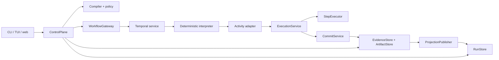
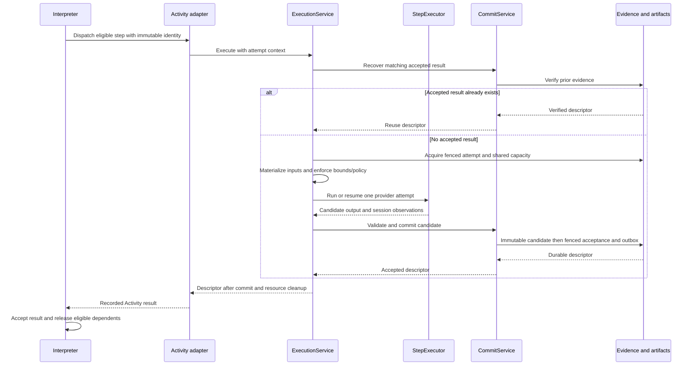

# Steward software architecture and responsibilities

Status: adopted module design for implementation; most directories and interfaces remain targets. Date: 2026-09-05. Decisions: [ADR-009](decisions.md#adr-009--explicit-module-ownership-and-inward-dependencies), refining ADR-001 through ADR-007, and [ADR-010](decisions.md#adr-010--one-repository-with-cli-server-and-ui-template-boundaries) for the current CLI/server/UI component extraction.

The user outcome is a workflow system whose behavior can change without duplicating orchestration, weakening evidence, or coupling execution to its interface. This document owns **where code belongs, who owns each decision, and which dependencies are allowed**. The [technical design](technical-design.md) owns runtime semantics; the [roadmap](production-roadmap.md) owns delivery and qualification; [current architecture](architecture.md) describes today's code.

Use one TypeScript package with explicit modules. Run the client, worker, optional dashboard, and projection publisher as independently supervised roles. A module is a code boundary, not a requirement for a separate server.

The current implementation has Steward CLI modules in `src/cli/`, Steward Server HTTP and template adapters in `src/server/`, and Steward Console browser code/templates in `ui/`. Root compatibility entrypoints preserve existing npm commands. The Temporal worker and flat legacy runtime modules remain in place. This establishes presentation and entrypoint boundaries; it does not establish the target control, execution, commit, store, or projection interfaces below. Approved display branding preserves existing `YAMLFLOW_*` settings and lowercase runtime/schema identities, as recorded in ADR-010.

## Responsibility overview

| Component | The question it answers | Primary responsibility |
|---|---|---|
| Spec parser and compiler | What work did the author declare? | Validate the language and produce a portable execution plan. |
| Policy service | Is this operation and capability set permitted? | Authorize operator commands and calculate enforceable execution permissions. |
| Control plane | How does an operator start, inspect, or control a run? | Bind the environment, deduplicate commands, submit them, reconcile status, and export evidence. |
| Temporal interpreter | What may run next? | Own dependencies, loops, human waits, recovery decisions, and execution lifecycle. |
| Execution service | How is this one attempt performed? | Materialize inputs, acquire attempt resources, invoke an executor, and hand its candidate to the commit service. |
| Executor adapter | How do we talk to this provider? | Launch/resume/cancel provider work and normalize its protocol. |
| Commit service | Is this output valid and durably accepted? | Validate content and identity, enforce fencing, and commit a single accepted result. |
| Storage adapters and projector | Where is evidence stored, and how is it read efficiently? | Persist immutable evidence and derive inspectable snapshots/events. |
| Presentation | How does the user understand and act on a run? | Format shared view models and submit explicit commands. |
| Runtime manager and bootstrap | Which services and adapters are running? | Resolve configuration, wire implementations, and manage service lifecycle. |

## Component interaction

Arrows here describe runtime calls/messages, not permission to import concrete implementations.

The control plane never calls `StepExecutor` to do workflow work. Only a scheduled Activity reaches the execution service. Human answers and finalization also reach the commit service through Activities, without launching a provider.

## Module ownership

Each module exposes a small public entry point. Internal files are private to that module. Interfaces are ordinary typed functions/objects; no dependency-injection framework or service locator is required.

| Target path | Owns | Boundary |
|---|---|---|
| `src/domain/` | Versioned plan/run/step/command/evidence types; pure identity, binding-path and loop rules; type-only ports. `schemas/` holds published wire schemas with parity checks. | No filesystem, environment, network, provider, database, UI, or Temporal runtime imports. Shared rules used by an interpreter are pinned/versioned with that interpreter. |
| `src/spec/` | YAML AST parsing, structural schemas, source locations, legacy V1 adaptation, unknown-field diagnostics. | Accepts source text and immutable inputs. It does not read files, discover profiles, or decide when nodes run. |
| `src/compiler/` | Semantic dependency/scope/reference checks, default expansion, limit checks, stable ordering, portable plan and semantic identity. | Receives capability descriptors as values. No executable probes, remote schema fetching, credential resolution, or Temporal connection. |
| `src/policy/` | Pure command authorization and capability intersection; explicit allowed/denied decisions and reasons. | Does not grant permissions from model output, fetch secrets, or claim a sandbox restriction was enforced. |
| `src/control/` | `ControlPlane` facade over start/observe/command/export use cases; `RuntimeManager` for service commands. Run manifests, durable command intent, source loading through a port, status reconciliation, export selection. | No subprocess provider execution, graph scheduling, or accepted step-output writes. May write command intent and immutable run inputs through ports. |
| `src/commands/` | Shared `CommandService`: command ID/payload conflict checks, durable intent/receipt lookup, and accepted/applied/rejected recording. | Called by control and command Activities. Does not authorize callers, decide whether a Workflow request is pending, or submit commands to Temporal. |
| `src/runtime/temporal/workflows/` | Versioned deterministic interpreters: readiness, per-run permits, loop outcomes, human/recovery request state, command applicability, cancellation/continuation decisions. | Only the Workflow SDK, pure domain rules, and type-only Activity contracts. No direct live-store reads or calls to implementation services. |
| `src/runtime/temporal/activities/` | Thin SDK adapters: capture execution/attempt identity, bridge heartbeat/cancellation, invoke execution, commit, or command-ledger services, map typed failures to Temporal failures. | Owns SDK mechanics. Does not call the public ControlPlane, implement provider protocol, or duplicate acceptance rules. |
| `src/runtime/temporal/client/` | `WorkflowGateway` implementation: start/describe/query/Update translation, including the product cancellation Update; connection reuse and namespace/task queue handling. | No independent product command IDs, YAML parsing, policy decisions, or status heuristics. |
| `src/execution/` | `ExecutionService`, `CommitService`, verified artifact resolution, bounded prompt/input construction, progress redaction, attempt admission and checkpoint persistence. | Owns one scheduled work unit. Does not choose downstream nodes, change loop policy, or retry the provider autonomously. |
| `src/executors/` | Built-in registry and provider adapters. Codex argument/protocol handling, session access, provider-error normalization, process tree cleanup, and policy enforcement. | Returns candidate output, session/checkpoint observations and normalized messages. No SQL commits, graph writes, or operator-command acceptance. Session/attempt files are private working data. |
| `src/store/` | Evidence, artifact, projection, source-loading, and checkpoint I/O implementations; schema migrations and transactional constraints. Projection publisher/rebuild jobs. | Enforces persistence invariants. Does not interpret YAML, grant authority, evaluate loop predicates, or schedule execution. |
| `src/presentation/` | Pure shared topology, status, loop-label and action view models from reconciled snapshots and capability descriptors. | No loop predicate evaluation or success inference from provider text. UI action visibility is advisory; commands are authorized again on submission. |
| `src/cli/`, `src/tui/`, `src/server/`, `ui/` | Argument/HTTP decoding, transport authentication, keyboard/browser interaction, rendering, output formats, and connection/cursor state. `src/server/` is the web adapter path selected by ADR-010. | Target dependencies are application interfaces and shared presentation, without raw store access, Temporal SDK handles, or duplicated scheduling/recovery rules. Current CLI/server direct client and store calls remain explicit legacy exceptions until those services are extracted. |
| `src/runtime/lifecycle/` | `RuntimeSupervisor` adapter: identity-checked local service start/stop, locks, probes, ownership, shutdown and log rotation. | Never starts a workflow. Remote profiles cannot start/stop infrastructure. Readiness reports are evidence, not a run-success verdict. |
| `src/bootstrap/` | Entry points, configuration precedence, profile validation, adapter selection, credentials-provider wiring, worker bundle registration and shutdown wiring. | Sole composition root importing concrete implementations across modules. Business decisions stay in the owning service. |

Keep `ControlPlane` as a facade with focused functions such as `startRun`, `observeRun`, `applyCommand`, and `exportRun`; do not grow it into a second interpreter. Keep execution coordination and output acceptance in separate functions/services even when they share one process.

## Interfaces between modules

These are responsibility contracts, not implemented APIs. Define versioned request/result schemas before coding against them. Consumer-owned port declarations live in `src/domain/ports/`; implementations are injected by bootstrap. A caller receives only the methods it needs.

| Interface | Consumer → implementation | Contract |
|---|---|---|
| `WorkflowSource` | Control → file/packaged-source adapter | Read bounded source/input bytes with an origin; no implicit execution. |
| `WorkflowCompiler` | Control → spec/compiler | Source, input, descriptors → diagnostics and immutable plan. No side effects. |
| `PolicyService` | Control and execution → policy | Actor/command or requested capabilities + frozen policy/descriptors → decision with reasons. |
| `WorkflowGateway` | Control → Temporal client | Persisted run identity → start/inspect; command identity → submit/reconcile. Returns domain snapshots/receipts, not SDK handles. |
| `CommandService` | Control and command Activities → commands | Stable command identity/payload → recorded intent or original receipt; compare-and-set lifecycle recording. No graph decisions. |
| `ExecutionActivities` | Interpreter → Activity adapter | Serializable dispatch → tagged `accepted` descriptor or `capacity_deferred` outcome; failures are typed. Human/final commit and command-evidence operations are explicit methods. |
| `ExecutionService` | Activity adapter → execution | Dispatch + local attempt context → accepted descriptor or capacity deferral; includes accepted-evidence fast path and durable provider invocation budget. |
| `StepExecutor` | Execution → provider adapter | Bounded resolved assignment + cancellation/checkpoint/message sinks → candidate output or classified failure. |
| `CommitService` | Execution/commit Activities → execution | Candidate/human answer/final output + verified identity → accepted commit descriptor and schema-validated bounded control operands from declared paths. Sole semantic acceptance writer; the interpreter evaluates predicates. |
| `EvidenceStore` | Application/execution services → SQL adapter | Narrow command, attempt, accepted-commit and outbox ports; uniqueness, compare-and-set, stable sequence and idempotent retries. |
| `ArtifactStore` | Control/execution/projector → file/object adapter | Conditional create and verified reads by immutable reference/hash/size. Mutable attempt files are excluded. |
| `RunStore` | Control → projected read adapter | Paginated snapshots/events/messages at consistent cursors; explicit stale, corrupt, or gap results. No acceptance mutation API. |
| `RuntimeSupervisor` | RuntimeManager → lifecycle adapter | Ensure/inspect/stop owned services for one profile; no workflow start, answer, or recovery. |

`EvidenceStore` is a family of narrow ports, not permission to pass a raw database connection everywhere. `StartRun` receives the command/run-intent writer. `CommitService` receives the accepted-output writer. The projector receives outbox reads and projection writes. No `setNodeStatus` or generic `markCompleted` API is exposed to presentation or control.

Cross-process requests and Activity contracts contain versioned JSON values and immutable references. Cancellation signals, byte streams, process handles, and credential resolvers are process-local dependencies, never serialized into Workflow history. Queries and synchronous Update validators do not perform asynchronous I/O; handlers use recorded Activity results where external evidence is needed. [Temporal message-passing contract](https://docs.temporal.io/develop/typescript/workflows/message-passing)

## Data and decision ownership

| State or decision | Semantic owner | Persistence / writer |
|---|---|---|
| Plan semantics and plan hash | Compiler | Control persists the immutable result through ArtifactStore. |
| Effective policy and environment manifest | Control using policy decisions | Run-intent writer; executors enforce the recorded policy at dispatch. |
| Workflow lifecycle, ready set, loop iteration, recovery cycle | Interpreter | Temporal history; accepted descriptors feed deterministic state. |
| Start/answer/recovery/cancel command identity | Control selects/binds identity; CommandService owns ledger invariants | Command ledger; Workflow handler owns application to current execution state. |
| Attempt lease/fence, shared capacity reservation, provider invocation budget | Execution service | Transactional attempt/lease port; adapter supplies clock/locking primitives. Budget survives Activity rescheduling. |
| Provider invocation/session state | Executor, reported to execution | Private session store plus bounded checkpoint persistence/heartbeat bridge. |
| Validated candidate and accepted output | Commit service | ArtifactStore plus transactional accepted-commit writer and outbox. |
| Loop accepted/passed/exhausted outcome | Interpreter | Explicit workflow event/descriptor; projection carries the outcome unchanged. |
| Final manifest content | Commit service, using interpreter-selected bindings | Immutable final artifact and acceptance record; Temporal closure remains separate. |
| Reconciled user-facing lifecycle/integrity/freshness | ObserveRun in control | Combines Temporal observation with verified evidence and projected data. |
| Snapshot/event cursor and readable transcript | ProjectionPublisher and progress sink | Rebuildable projection rows/exports; retained source evidence follows retention policy. |
| Selected item, scroll, reconnect indicator, draft answer | Presentation adapter | Transient client state only. |

Keep event meaning precise: `output.committed` reports evidence acceptance; `step.accepted` reports interpreter progression; `run.result_committed` reports a final artifact; a successful Temporal close is separately observed. Storage never manufactures interpreter events from the existence of a file. A projection may lag any of these stages.

The runtime owns loop evaluation and publishes a `LoopOutcome` such as `passed`, `exhausted_accepted`, or `exhausted_failed`, with iteration count and predicate identity. Presentation formats that value. Legacy records without sufficient evidence show an unknown outcome rather than guessing. Provider attempt, logical iteration, and operator recovery cycle remain three different counters.

## End-to-end responsibilities

### Start and observe

1. CLI/HTTP decodes the request and authenticates the caller. Control authorizes the operation, loads bounded source/input, and calls the compiler.
2. Control checks policy/capabilities, freezes the run manifest, and persists a command ID, immutable inputs, and start intent. Invalid input never reaches a provider or runtime start.
3. Where the profile explicitly enables local startup, RuntimeManager ensures the required services after validation. Bootstrap-created adapters establish the configured connections. `attach`, status reads, and compilation do not start work.
4. Control submits the recorded Workflow ID through WorkflowGateway. A lost response is reconciled against that same identity; retry does not allocate a new run.
5. ObserveRun combines execution lifecycle, evidence integrity, and projection freshness. Presentation shows the resulting view model. The compiler and executor are absent from this read path.

### Execute and accept a step

All candidates, including human and final results, use CommitService. The executor may validate provider protocol early, but only CommitService validates the product's accepted-output contract. Duplicate checking before dispatch is an optimization; transactional acceptance still guards every commit.

There are two permit authorities. The interpreter reserves per-run scheduling capacity deterministically. Execution acquires all enforceable executor quotas together in a store transaction, checking the frozen run/scope/workspace limits. There is no atomic transaction across Workflow state and SQL. On capacity denial, return a typed capacity result, release the local scheduling reservation, and wait with bounded durable backoff; do not consume a provider attempt or hold partial backend permits. Use stable acquisition IDs, cleanup, and lease recovery for lost responses. A fence prevents stale output acceptance; it does not prove an old provider process stopped. Cleanup uncertainty stays visible when enforcing actual process capacity.

ExecutionService persists the provider invocation count per dispatch and consumes a slot transactionally immediately before calling the executor to start/resume. Capacity deferral never resets that count, even if the next Activity has a new SDK retry counter. Automatic Activity retries still use Temporal policy, while the durable dispatch budget bounds actual provider invocations across rescheduling. A crash between budget consumption and launch is conservatively charged unless non-launch can be proven. Only an explicit new recovery cycle receives a new dispatch budget. Preserve Temporal Activity attempt metadata separately from the provider invocation count.

### Human answers, recovery, and cancellation

Control authorizes and uses CommandService to deduplicate the command before submitting it through WorkflowGateway. The interpreter decides whether a new command applies to its current request, after checking any recorded duplicate receipt through a command Activity when needed. That Activity uses the same CommandService; it never calls the public ControlPlane. The interpreter invokes a commit Activity for a human answer, creates a new dispatch cycle for approved recovery, or stops scheduling and requests Activity cancellation. Existing identical commands return their original receipt even after the request is consumed.

The normal `WorkflowGateway.cancel` path submits a durable product cancellation Update, rather than immediately cancelling the entire Workflow through the SDK. The interpreter stops new scheduling and runs acceptance-epoch revocation in a separate cleanup scope before cancelling provider scopes. Revocation and cleanup-ledger Activities remain runnable in that shielded, bounded scope. The Activity adapter bridges cancellation to ExecutionService; the executor terminates its work; execution releases its leases; the interpreter records progress or unresolved cleanup. If revocation storage is unavailable, stop provider work where possible and report cleanup/integrity uncertainty instead of successful cleanup.

CommitService checks the same revocation epoch in its acceptance transaction: an output committed before revocation remains accepted, and a later candidate rejects. This transaction orders the acceptance-versus-cancellation race. Out-of-band SDK cancellation uses the Workflow's shielded cleanup handler; forced termination may prevent any handler and must remain an unresolved-cleanup condition until independently reconciled. The CLI's exit or TUI detach does none of this. RuntimeManager stopping an owned service is also distinct from cancelling a run.

### Projection, repair, and export

Commit/application writers persist outbox entries with their evidence transactions. A ProjectionPublisher consumes them idempotently, updates read models and cursors, and serves no scheduling role. A lagging publisher cannot block committed execution or safe history continuation. Evidence conflicts go to reconciliation/repair reporting; a projector cannot accept an orphan candidate or invent missing output.

ExportRun authorizes the read, obtains a reconciled observation, verifies selected evidence through ArtifactStore, and writes a versioned export through an output adapter. It records omissions and incomplete state. It never asks an executor to regenerate a missing result. The commit service's evidence-verification contract is reusable here through a read-only port, without exposing commit methods to export.

## Dependency rules

| Code | Permitted runtime dependencies |
|---|---|
| Domain | Pure language/runtime utilities only; contract types use type-only imports. |
| Spec, compiler, policy | Domain; compiler may use spec and pure parsing/validation/hashing libraries. No host discovery or I/O. |
| Control | Domain, spec/compiler, policy, commands, shared presentation, injected ports. No concrete Temporal/store/executor/lifecycle adapters. |
| Commands | Domain and injected command-ledger ports; no control facade, Workflow SDK, or raw database handle. |
| Workflow bundle | Workflow SDK and a version-pinned subset of pure domain rules; Activity contract types only. |
| Activity adapter | Activity SDK, domain, execution and command-ledger services. |
| Execution | Domain, policy, schema/integrity utilities, injected executor/storage/resource ports. No control-plane facade or Workflow SDK. |
| Executor/store/client/lifecycle adapters | Domain and the concrete SDKs/OS APIs necessary for their port. They do not import each other to bypass services. |
| Presentation | Domain snapshots and capabilities; pure formatting/layout utilities. |
| CLI/TUI/web | Application facades, presentation, transport/rendering libraries. |
| Bootstrap | Concrete implementations for dependency wiring; no policy or graph rules. |

Separate pure utilities from I/O adapters even when they share a directory. Avoid a top-level barrel that re-exports an executor or store into the Workflow bundle. UI controls revalidate on submission; a shared action view model is never an authorization token.

## Current code to target ownership

This is an extraction map, not an instruction to move legacy code in place. Preserve old Workflow/Activity exports and their helper behavior for supported histories.

| Current files/functions | Target owner |
|---|---|
| `src/contracts.ts` | Domain types and versioned wire/port contracts. |
| `src/definition.ts`: parsing, normalization, graph/schema checks | Spec + compiler; `loadWorkflow`/`loadInitialInput` I/O moves behind WorkflowSource. |
| `src/resolver.ts`, `src/loop.ts` | Pure binding/loop rules; compiler validates paths, execution materializes referenced data, interpreter evaluates bounded loop operands. Preserve legacy versions. |
| `src/workflows.ts`: ready batches, loops, human/recovery handlers | Legacy interpreters remain pinned; new scheduling and handlers live in the V3 Workflow module. |
| `src/activities.ts`: `executeAgentV2`, prompt construction, heartbeat | Execution service + thin Activity identity/heartbeat/failure adapter. |
| `src/activities.ts`: `runCodex`, child cleanup, simulated output | Codex and simulated executor adapters. |
| `src/completion-receipt.ts`: build/validate/recover/commit and filesystem helpers | Pure identity/integrity rules + CommitService + ArtifactStore; separate semantics from path/link/write operations. |
| `src/execution-policy.ts`: failure parsing, Codex args, checkpoints, limits | Executor protocol adapter, Activity bridge, pure domain checkpoint matching, and policy/limit configuration respectively. |
| `src/store.ts`: artifact writes, event sequencing, `rebuildState`, messages | ArtifactStore, EvidenceStore/outbox, ProjectionPublisher/RunStore, and execution progress sink. |
| `src/agent-stream.ts` | Codex protocol extraction → executor; redaction/persistence admission → execution; display formatting → presentation. |
| `src/client.ts`: SDK connections/start/Updates and run IDs | Temporal client adapter + control start/command identity use cases. |
| `src/cli/start.ts`, `src/cli/answer.ts`; root `src/start.ts`, `src/answer.ts` wrappers | CLI adapters calling common application services. They currently use the shared `src/client.ts` adapter directly. |
| `src/server/index.ts`; root `src/server.ts` wrapper: HTTP, snapshots, file scans, mutations | Web transport + ObserveRun/command services + read-store adapters. `createDashboardServer` constructs the HTTP server and `main` listens; importing the component does neither. |
| `src/server/templates.ts`, `ui/templates/`, `ui/brand.json` | Presentation composition and allowlisted asset/template serving. Brand text is escaped; UI files resolve from the module location. No execution-state ownership. |
| `ui/assets/app.js`: graph/labels/actions/local state | Shared presentation view models + browser rendering. Remove runtime predicate ownership from the UI during the relevant implementation slice. |
| `ui/assets/appearance.js`, `styles.css`, `themes.css`, `layouts.css` | Browser preference/keyboard policy and presentation styling. Layout/theme changes retain the same event stream, action handlers, and current form DOM. |
| `src/cli/launcher.ts`; root `src/launcher.ts` wrapper; `src/config.ts`, `src/worker.ts` | RuntimeManager + lifecycle adapter + bootstrap/config and worker entrypoint. The launcher still hardcodes its database/log paths despite the store's runtime-directory override. |
| `scripts/recovery-check.ts`, existing tests | Release/integration harness and owner-specific unit/contract fixtures. |

One verified example of why this split matters: `ui/assets/app.js` currently re-evaluates loop predicates but does not handle `contains` or `truthy`, which `src/loop.ts` supports. Target snapshots carry the interpreter's outcome so web and TUI cannot disagree by implementing different predicates. The component/template extraction preserves this legacy behavior; it does not fix that gap.

UI templates share a single application behavior layer. The server accepts only known component tokens and public asset paths; layouts and themes do not select another interpreter or provider. Keep appearance choices in browser preferences and branding in `ui/brand.json`. A future template must preserve mount points and operator drafts and must not duplicate command submission or infer a different run status.

## Enforcement and implementation order

At the P1 contract slice, add import-boundary checks for the new module roots, a Workflow bundle import check, public schema/TypeScript parity checks, and small contract suites for each port. Keep a narrow, documented legacy exception set with no new callers; do not weaken the new rules to accommodate the old flat layout.

Behavioral checks follow ownership: compiler golden plans/diagnostics; policy deny/capability fixtures; control lost-response command tests; interpreter replay/readiness/loop fixtures; execution heartbeat/cancel/capacity tests; executor protocol fixtures; commit corruption/fence/race tests; store backend contract tests; projection rebuild/cursor tests; presentation fixtures for every loop outcome and counter. A folder move alone is not evidence of separation.

Implement the roadmap's human-answer-to-agent slice through these interfaces first. Freeze its contracts before parallel work. Then extract executor protocol and commit/storage behavior, introduce V3 scheduling, and connect CLI/web/TUI to the common read/control contracts. P0 fixes may remain narrowly in current files where replay-safe; this target layout must not delay them.

For each substantive change, name the owning module and applicable ADR, identify the public contract affected, and verify no forbidden dependency was introduced. Add a module only when it owns a distinct decision or replaceable external boundary; do not split every function into its own service.
