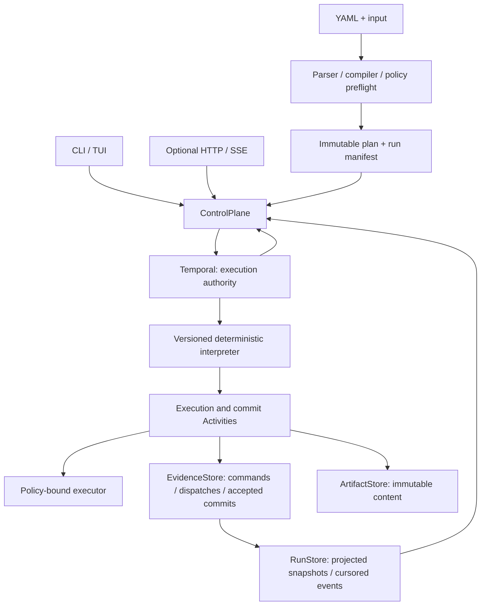

# Steward production technical design

Status: target design, not implemented production behavior. Date: 2026-09-07.

This design implements the [vision](vision.md) and [adopted decisions](decisions.md). The [CLI specification](cli-architecture-and-product-spec.md) remains the detailed command, presentation, and future language reference. Where it conflicts with this design, this design governs. The [roadmap](production-roadmap.md) governs delivery order.

The [software architecture](software-architecture.md) assigns these contracts to modules, defines allowed dependencies, and maps current files to their future owners. This document governs behavioral semantics; that companion governs code ownership.

## Current baseline and gaps

The current package is a private TypeScript demo. Its build script typechecks without emitting a package. It runs `version: 1` YAML through the single `stewardWorkflow` Temporal interpreter, with simulated/Codex Activities, agent completion receipts, bounded node loops, human questions, and a disk-backed dashboard.

The current component extraction keeps one package with Steward CLI command modules under `src/cli/`, a Steward Server factory/entrypoint and template adapter under `src/server/`, and the shared Steward Console shell/components/assets under `ui/`. Root wrappers retain existing npm and recovery-harness entry paths. Board/Review layouts and Dark/Light/System themes share the same event and command code; browser preferences do not alter execution. Build mode adds bounded Codex/Claude `version: 1` authoring and a parser-gated synthetic SVG preview; it does not persist a draft or start Temporal. [ADR-010](decisions.md#adr-010--one-repository-with-cli-server-and-ui-template-boundaries), [ADR-013](decisions.md#adr-013--agent-assisted-authoring-stays-outside-execution-authority), and [ADR-016](decisions.md#adr-016--one-pre-adoption-interpreter-without-compatibility-shims) define these boundaries. Some configuration and stored identities retain the earlier YAMLFlow spelling, while new execution uses `stewardWorkflow` exclusively.

Source review on 2026-09-05 found these gaps. They are implementation work, not claims that this document fixes them:

| Gap | Current source | Required change |
|---|---|---|
| Human outputs and final results do not use the shared artifact commit path | `src/workflows.ts`, human branch and final transition | Commit schema-valid human and final outputs before graph/result acceptance. |
| The disk projection is serialized only within one Steward worker process | `src/store.ts`, process-local event/message queues | Move projection behind Temporal-owned coordination before supporting worker replicas; do not add a second queue or lock authority. |
| Complete definitions/inputs/results recur in Activity payloads | `src/workflows.ts`, transition/dispatch/result construction | Bounded descriptors and immutable artifact references. |
| Dashboard lifecycle and health come from disk | `src/server/index.ts`, `snapshot` and `/health` | Temporal reconciliation and independent liveness/readiness contracts. |
| Start requests have no stable caller command identity | `src/client.ts`, `src/cli/start.ts`, `/api/runs` | Durable start intent and uncertain-response reconciliation. A browser in-flight guard is not durable deduplication. |
| HTTP control is always enabled; bodies are unbounded | `src/server/index.ts`, `body` and POST routes | Explicit control capability, request schemas and limits. |
| Browser loop evaluation omits supported runtime operators | `ui/assets/app.js`, `loopConditionMet`; `src/loop.ts` | Publish a typed runtime loop outcome and format it in shared presentation. |
| Runtime is coupled to examples, cwd, source files, and unverified listening ports | `src/cli/launcher.ts`, `src/config.ts`, `package.json` | Packaged assets, validated profiles, service ownership and readiness. UI assets now resolve module-relatively, but runtime paths and child entrypoints remain cwd-relative. |
| Launcher database/log paths and Temporal probe ignore runtime/address overrides used elsewhere | `src/cli/launcher.ts`, `src/store.ts`, `src/config.ts` | A shared validated runtime profile must align the database, artifact directory, logs, and Temporal address. `YAMLFLOW_RUNTIME_DIR` currently does not relocate the launcher's `runtime/temporal.db` or `runtime/services`. |

The previous bare-`r` typing gap is addressed in `ui/assets/appearance.js`: the shortcut rejects editable controls/descendants, modified or repeated keys, and a disabled start action. `ui/assets/app.js` guards duplicate invocations while a start request is in flight. These are browser interaction fixes; server-side command identity and authorization remain open work.

For this component change on 2026-09-05, `npm run verify` completed with exit 0 and 25/25 tests; isolated simulated recovery also passed with no provider reruns or repeated completed siblings. Browser checks covered the selectable layouts/themes, preference persistence, unsent input, and mobile width. See [validation notes](validation/component-ui-2026-09-05.md). No production, full replay, relocation, or live-provider qualification is established by these checks; no release gate is marked passed.

## Components and authority

Keep one package with the boundaries in the software architecture. `domain` contains contracts and pure rules; `spec`/`compiler` validate intent; `policy` decides permissions; `control` coordinates use cases; `commands` shares ledger rules; `runtime/temporal` owns SDK translation and deterministic scheduling; `execution` coordinates attempts and commits; `executors` own provider protocol; `store` implements persistence and projections. Shared presentation feeds CLI, TUI, and web. Bootstrap wires adapters, while runtime lifecycle supervises services.

Workflow code imports no filesystem, database, provider, or environment-reading implementation. A Workflow schedules Activities and uses their recorded results. It never reads the live evidence database to make replay decisions. The operator/root agent starts, inspects, and controls work; domain prompts execute only in assigned workers.

There are three different authorities:

- Temporal history determines what execution accepted and what may run next.
- Accepted commit records plus immutable artifacts establish the identity and content of a result.
- Projections make that information readable. They may lag and can be rebuilt; they never authorize work.

Commands, accepted commits, and provider checkpoints are retained evidence. Calling snapshots rebuildable does not mean the whole evidence database is disposable.

## Version and identity contracts

Language, plan, and interpreter versions are independent:

| Axis | Existing | Target |
|---|---|---|
| Authored language | `version: 1` | V1 supported; new envelope `yamlflow.dev/v1alpha1` introduced in stages |
| Normalized input | `WorkflowDefinition` | `yamlflow.execution-plan.v1` |
| Temporal Workflow type | `stewardWorkflow` | Version only after adoption or an incompatible contract change |
| Evidence | `agent-completion-receipt.v1` | Versioned common output commit and result manifest |

Persist exact source, compiled plan, validated input, and a run manifest before submitting a start. The manifest records schema/compiler/package/worker/executor versions, source/plan/input hashes, effective policy, workspace binding, provider destination, Temporal namespace/task queue, and storage profile. Credential values are never included.

Choose RFC 8785 canonical JSON for normalized JSON hash payloads; reject values outside the supported JSON domain. Hash exact UTF-8 YAML separately. [JSON Canonicalization Scheme](https://www.rfc-editor.org/info/rfc8785/)

`planSha256` hashes executable semantics after defaults and dependency ordering are normalized. Exclude `planSha256` itself, source bytes/hash, source locations, compiler build provenance, and display-only metadata. Preserve semantically significant array order. Persist excluded provenance alongside the plan and hash the full run manifest separately. Formatting, comments, or map ordering must not change semantic identity; retry policy, prompt, dependencies, schemas, and execution order must.

Separate these identities:

| Identity | Lifetime |
|---|---|
| Application `runId` / Temporal `workflowId` | One logical run; stable across continuation |
| Temporal `runId` | One history segment; changes on Continue-As-New or reset |
| Step instance | Qualified step ID plus the full nested loop iteration path |
| Dispatch | Step instance + recovery cycle + persisted dispatch token |
| Attempt | Dispatch + Activity attempt/fencing epoch; isolated working directory |
| Command | Caller-generated ID bound to actor, operation, run, and payload hash |

Receipt provenance keeps the originating Temporal Run ID. A continuation may carry an already accepted reference from that execution; it must not rebind an old receipt to the new Run ID. Reset/fork adoption of evidence requires an explicit audited lineage operation and is not an automatic retry.

## Compilation and executor selection

Validate YAML syntax with source locations, strict structure, graph/scopes, references, output paths where statically knowable, input schemas, executors, capabilities, policy, and limits before start. Referenced predecessors must be declared dependencies. Runtime validation checks any values that cannot be proven statically. Reject unknown fields, unsupported constructs, remote schema resolution, arbitrary expressions, and unbounded cycles.

Use a separate Ajv 2020 validator for future Draft 2020-12 contracts. Ajv does not mix Draft 2020-12 and older drafts in one instance. [Ajv JSON Schema support](https://ajv.js.org/json-schema.html#draft-2020-12-breaking)

Resolve executor selection once: explicit step executor, then workflow default. A simulation override is explicit, recorded in the manifest, and visibly labels the whole run simulated. The current run-wide `mode` remains explicit until executor selection is compiled into the plan.

The compiled-plan foundation covers existing DAG, named-limit, node-loop, and human-gate semantics. Nested executable scopes follow in a separate milestone. Unknown future syntax fails validation rather than being flattened into different behavior.

## Completion protocol

An output commit descriptor contains version, run/step/dispatch identity, originating execution, effective policy and executor build hashes, resolved input/prompt/schema hashes, immutable output reference, byte size, output hash, and receipt hash. Human commits substitute authenticated answer-command provenance for provider-session provenance.

1. Before dispatch, record a durable dispatch identity and acquire its current attempt lease/fencing epoch. Give the process an attempt-specific output directory.
2. Resolve referenced inputs inside the Activity, verify hashes and schemas, then execute under the frozen policy. Heartbeat only bounded identity, phase, and resumable session metadata.
3. Parse output and validate schema and size. Write candidate output and receipt with conditional creation under an attempt/fencing-epoch or content-addressed namespace within the dispatch. A stale attempt must not be able to occupy the valid attempt's receipt path. Local writes must be flushed durably before acceptance; object storage must acknowledge the required write durability.
4. In one evidence transaction, verify the fencing epoch, insert the immutable candidate, select the accepted result for that step iteration with compare-and-set, and enqueue an idempotent event in an outbox. A repeated identical commit returns the original descriptor. A conflicting hash is an integrity failure.
5. Return the descriptor only after acceptance commits. Temporal records the Activity result. Only then may the interpreter release dependents or evaluate the next loop transition.
6. Publish projections from the outbox. A retry after a lost acknowledgement verifies and returns the accepted descriptor without invoking the provider again.

There is no cross-system atomic transaction. An object without a SQL acceptance record is an orphan candidate; reconciliation may accept it only after checking identity and current fencing. A SQL commit without a Temporal acknowledgement is an accepted candidate awaiting execution reconciliation. A UI must not turn that condition into final Workflow success.

Use separate immutable dispatch paths for new recovery cycles; quarantine invalid evidence and retain its identity. An expired attempt or superseded recovery cycle cannot accept output. A logical loop step is complete only when the interpreter accepts the loop's terminal output under its exhaustion/condition policy; earlier iteration commits remain audit evidence.

Human answers use the same commit path through a commit Activity after a validated durable Update. An Update receipt acknowledges the answer command; downstream release still waits for the output commit. Finalization commits a result manifest containing plan/input identity, final output bindings, accepted receipt references, and loop acceptance/exhaustion outcomes. For V1, which has no workflow-level output declaration, expose every node's final accepted output keyed by node ID, preserving the existing returned output-map semantics. New-language workflows use explicit workflow output bindings. Retain provenance references for every accepted step in both cases. The Workflow returns its manifest reference. Report success only after Temporal closes successfully and the manifest verifies.

Hashes establish content identity, not proof against someone with write access to all evidence. Store credentials and process isolation constrain trusted writers. Conflicting evidence blocks completion; the control plane cannot invent replacement output.

## Scheduling, retry, and control semantics

The target scheduler releases a step as soon as its own dependencies commit and its parent scope is active. Ready ties use stable compiled ordering. The interpreter reserves per-run scheduling capacity; the execution service acquires all applicable executor quotas atomically within the evidence store before launching a provider. Workflow state and SQL do not share a transaction. Capacity denial releases the scheduling reservation and leads to bounded durable waiting, without partial backend permits or a consumed provider attempt. A human/recovery wait consumes no executor permit.

YAML pools limit concurrency within one run. Operator workspace limits bound all runs on one local runtime; the production shared profile needs coordinated leases for an equivalent global cap. Task queue or per-worker limits must not be advertised as a cluster-wide quota.

Each automatic retry retains the dispatch identity; a deliberate recovery creates a new cycle with a fresh bounded automatic-attempt budget. Same-session recovery requires a matching checkpoint, supported failure class, accessible session data, and the same enforceable policy. A host-local Codex session is not portable merely because its ID was heartbeated. Route it to its session owner or mark it unavailable; never silently substitute a fresh session.

Persist a provider invocation budget per dispatch in the evidence store. Admission deferrals and Activity rescheduling cannot reset it. Execution consumes a budget slot immediately before start/resume; uncertain launch after a crash is conservatively counted. Temporal's per-Activity retry counter remains separate metadata and cannot alone enforce this cross-rescheduling limit.

Provider work can happen more than once before output acceptance. Fence output acceptance and constrain external effects; do not promise exactly-once inference or billing. Cancellation stops scheduling new work, revokes active acceptance leases, cancels Activity scopes, and asks executors to terminate descendants. Track requested, in-progress, and acknowledged cancellation. Terminal cancellation requires cleanup acknowledgement or an explicit unresolved-cleanup condition. Detach and terminal exit have no cancellation effect.

Normal product cancellation is a durable Update. Revocation and cleanup-recording Activities run in a separate shielded, bounded scope, with revocation preceding provider-scope cancellation on the healthy path. Out-of-band SDK cancellation also needs shielded cleanup; forced termination cannot promise that handlers run. See the software architecture for ownership and acceptance-versus-cancellation ordering.

`ControlPlane` includes `validate`, `compile`, `start`, `getRun`, `listRuns`, `watchRun`, `getCommand`, `exportRun`, `submitHumanAnswer`, `submitRecovery`, and `cancel`. Each mutating request supplies a command ID and expected run/request identity. Persist command intent before sending to Temporal. For start, bind that command to one Workflow ID and reject reuse with different payloads; on a lost response, describe that exact Workflow ID and reconcile its manifest rather than generating another ID. Enforce duplicate rejection for closed IDs as well as active ones. `getCommand` exposes accepted/applied/rejected/uncertain status and the original receipt for reconciliation.

Use a stable Temporal Update ID plus the durable command registry for answer/recovery deduplication across retries and continuation. Deduplicate command ID and payload before testing whether the request is still pending: an identical applied command returns its original receipt even after its request is consumed or the Workflow closes. Conflicting duplicates reject. The control service checks retained receipts first. Synchronous Update validators check structure and immutable identity without I/O; the handler obtains uncached prior command evidence through a recorded Activity result, serializes commands for the same request, and checks replayed pending state only for a new command. Persist accepted versus applied command states separately so a crash between Temporal acceptance and local recording can be reconciled. Continuation carries bounded cache/reference state; it does not discard the retained command ledger.

Expose `yamlflow answer <run-id> --request <id> --file <answer.json>` and `yamlflow cancel <run-id>` alongside the existing proposed commands. Mutations accept `--command-id`; otherwise the CLI persists a generated ID before sending and prints it on uncertain failure. Keep `npm run answer` compatible. `resume` reattaches; `recover` retries; neither creates a new logical run.

`yamlflow export <run-id> --output <directory>` calls `exportRun` to produce a `yamlflow.export-manifest.v1` plus selected artifacts. Reconcile lifecycle first and verify each included object's byte length and hash. Include source/plan/input provenance, final result reference when available, accepted receipt references, and the observation cursor. For open/failed/cancelled runs, label the bundle incomplete and include only available accepted evidence; never synthesize a final result. Default export omits raw provider logs and credentials, applies operator access policy, and lists every omitted/redacted artifact with a reason. Redacted derivatives have their own hashes and provenance and are never described as the original evidence. Report whether verification covers complete evidence or only the included subset. Write to a new directory; replacing an existing export is an explicit operation.

## Storage, status, and history limits

The local application database uses transactions, unique command/event/commit IDs, monotonic per-run sequence allocation, an outbox, schema migrations, and crash-safe writes. It is separate from `runtime/temporal.db`. Local artifact directories remain separate from the database. The shared backend provides the same contract with PostgreSQL and external object storage. Test both implementations against the same store contract suite.

A snapshot includes execution lifecycle, step states, evidence integrity, `lastSeq`, `observedAt`, and reconciliation status (`current`, `stale`, or `unavailable`). Temporal unavailable means status is unconfirmed, not failed or completed. Corrupt projections remain visible with a rebuild/error state instead of disappearing from run lists. Closed executions do not display Resume/recovery commands intended for open executions.

The interpreter emits a typed loop outcome with its predicate identity and iteration count. Projections retain it; shared presentation formats it. Web and TUI do not re-evaluate predicates against output. Missing outcome evidence is shown as unknown. Attempt, iteration, and recovery cycle remain separate counters.

Stream incremental events from a consistent snapshot cursor. Deduplicate by event ID, paginate events/messages, bound per-client buffers, and disconnect slow clients with a resumable cursor. An expired cursor returns an explicit gap and a new snapshot; it does not pretend retained events are a complete audit. Raw provider protocol is kept out of the default transcript.

Initial limits below are chosen engineering defaults to validate in load tests, not measured capacity or Temporal service limits. Persist effective limits in the run manifest; relaxing them requires renewed qualification.

| Resource | Initial default |
|---|---:|
| Authored YAML / initial input | 1 MiB each |
| Embedded compiled plan | 256 KiB |
| Workflow start/continuation payload | 512 KiB total |
| Other Workflow/Activity command or result payload | 64 KiB |
| Declared control operands returned with an output | 8 KiB |
| Structured output / ordinary HTTP command body | 2 MiB / 64 KiB |
| Static steps / nesting depth | 500 / 8 |
| Loop iterations / expanded step instances | 20 per loop / 5,000 per run |
| Automatic provider invocations / operator recovery cycles | 5 per dispatch / 10 per step instance |
| Concurrent executor work | 16 per run, 32 per local workspace |

Keep bulk inputs, prompts, outputs, and transcripts in artifacts. Activities return references and only the bounded, declared operands needed for deterministic scheduling/loop predicates. Reject oversized control operands rather than importing whole outputs into history. Rotate operational logs and apply explicit transcript retention with visible truncation metadata.

Request a continuation when the SDK suggests it or the application reaches 5,000 history events or 8 MiB of history, whichever occurs first. Stop new dispatch, drain in-flight Activities and message handlers, durably commit acceptance records, outbox entries and the execution checkpoint, then continue from the main Workflow function. Projection publication may lag and must not block continuation. Carry bounded accepted references, current scope/loop state, pending human/recovery request IDs, command deduplication references, and the event cursor. [Temporal continuation guidance](https://docs.temporal.io/develop/typescript/workflows/continue-as-new)

The release gate must prove enough headroom for maximum-concurrency draining; a threshold alone is not a guarantee. A pending human/recovery request can be carried without holding an active handler. Checkpoint size is checked before dispatch expands state. Failure to produce a bounded checkpoint stops further work with an explicit limit condition.

## Security and operation

Local dashboard control is off by default. Enabling it requires a local session credential, strict Host/Origin checks, JSON content type, request validation, body/time limits, and a command capability scoped to the selected profile. Do not place credentials in URLs. Remote binding requires TLS and configured authentication/authorization. Shared production uses OIDC identities for operators, service credentials for workers, and run-scoped read/operate/admin permissions; no anonymous mutation or artifact enumeration.

Pin the workspace binding and constrain paths against traversal/symlink escape. Use allowlisted environment variables and isolated runtime/credential locations. A read-only filesystem flag alone is not evidence that all requested network or tool restrictions are enforced. Reject unsupported restrictions and test the actual adapter. Store task content with encryption and access control appropriate to the selected provider and team policy.

Local services use a supervisor lock and a verified runtime/profile identity, not a listening port as ownership proof. Remote profiles never start or stop infrastructure. `/live` reports process liveness; `/ready` and `doctor` independently report Temporal connectivity, compatible worker availability, store access, migration status, artifact access, and durability tier. Waiting for a worker is observable and distinct from an invalid run.

For production, use a prebuilt Workflow bundle and independently supervised workers. Ship a reproducible package with a lockfile, executable, bundled assets, migrations, schemas, and build manifest. Keep Temporal SDK packages aligned. Choose a supported Node LTS and the Codex CLI version at release freeze; record and test exact versions rather than relying on a floating host installation.

Emit structured operational logs and metrics for command acceptance, scheduling latency, retries, pending recovery age, heartbeat timeout, artifact commit failure, integrity failure, history size, projection lag, active leases, and provider usage when supplied. Correlate run/step/dispatch IDs in logs and traces; avoid those high-cardinality values as metric labels. Exclude task content and credentials from metrics.

Back up durable evidence and artifact references together with a manifest and store versions. Use the production Temporal service's supported retention/recovery mechanisms independently; a SQL backup is not a Temporal history backup. Retain referenced artifacts through open runs and the supported replay/reset/restore window. No automatic deletion of active-run evidence. Restores must verify every referenced hash and reconcile Temporal before accepting control commands.

## Migration and rollback

Before adoption, current runs use only `stewardWorkflow`; the earlier pre-adoption Workflow types are intentionally not registered. Preserve the existing runtime database and run directories without rewriting histories or receipt identities. Their artifacts remain read-only evidence, while resuming one of those executions requires its matching historical bundle.

After adoption, introduce incompatible interpreter or evidence changes through a new versioned Workflow type and additive evidence migration. Canary new runs, drain compatible histories, and never fabricate missing attestations.

Promote only after the release evidence passes. On regression, stop new starts and route new work back to the last supported profile/bundle. After adoption, keep compatible workers for histories under every supported version until drained or repaired. Application rollback must not blindly downgrade a migrated database; use an expand/contract migration window and a tested restore plan. The [roadmap](production-roadmap.md) defines the stop conditions and evidence owners.
